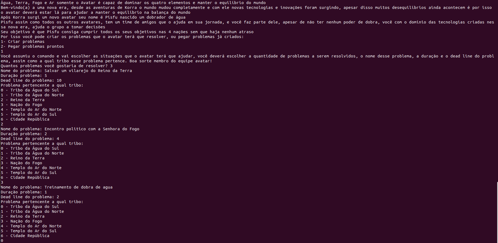
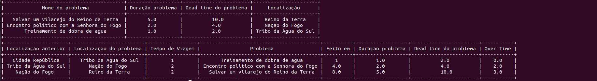

# Avatar_Schedule

**Número da Lista**: 1<br>
**Conteúdo da Disciplina**: Algoritmos Ambiciosos (Greed)<br>

## Alunos
|Matrícula | Aluno |
| -- | -- |
| 17/0122549 |  Paulo Gonçalves Lima |
| 17/0113060  |  Pedro Vítor de Salles Cella|

## Sobre 
O projeto tem como objetivo utilizar do algoritmo de atraso mínimo para organizar uma rotina sendo ela criada pelo usuário ou utilizando a rotina criada no próprio código, sendo usando no contexto da animação Avatar, no programa foi utilizado grafos para estabelecer uma relação de deslocamento, ou seja, com o auxílio de grafos temos o tempo de deslocamento entre uma cidade e outra para ser considerado no cálculo de resolução dos problemas.

## Screenshots







## Instalação 
**Linguagem**: Python<br>

<p>Para usar nosso projeto primeiro deve-se ter instalado o Python3 e uma biblioteca do Python chamada prettytable, siga as etapas:</p>
 
<p>Caso não tenha o Python3 instalado:</p>
 
```
sudo apt-get install python3
```
 
<p>Para instalar a biblioteca é bem simples, basta baixar pelo Linux ou baixar usando o pip</p>
 
Linux<br>
```
sudo apt-get install -y python3-prettytable
```
 
Pip<br>
```
python -m pip install -U prettytable
```
Ou
```
pip3 install prettytable
```
## Uso 
Apenas rode o comando:
`python3 main.py`
